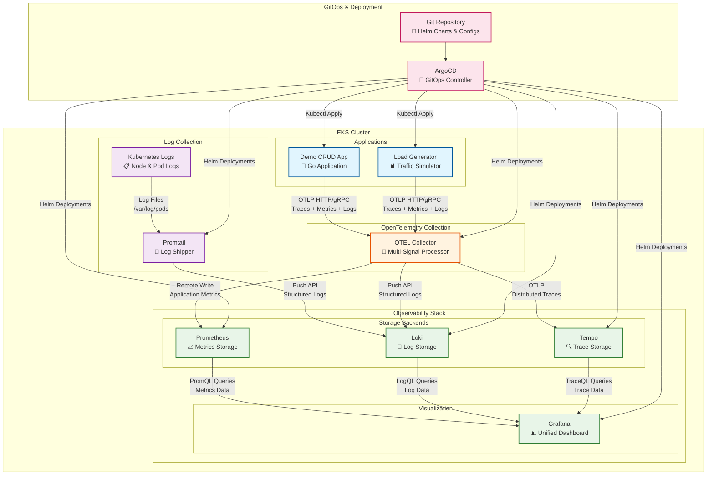

# EKS with OpenTelemetry Observability Stack

A complete, production-ready observability solution for Amazon EKS with OpenTelemetry, featuring distributed tracing, structured logging, metrics collection, and a demo Go CRUD application.

## 📊 Current Implementation Status

### ✅ **Completed & Ready to Deploy**
- **📈 Prometheus** - Metrics collection and storage with persistent volumes
- **📊 Grafana** - Unified visualization dashboard with persistence enabled
- **📝 Loki** - Log aggregation system with SimpleScalable architecture
- **📄 Promtail** - Log collection DaemonSet for Kubernetes logs
- **🔍 Tempo** - Distributed tracing storage backend
- **🔧 Enhanced OpenTelemetry Collector** - Multi-signal telemetry processing (traces, metrics, logs)
- **🚀 Demo Go CRUD Application** - Fully instrumented with OpenTelemetry tracing and structured logging
- **📊 Automated Load Generator** - Continuously generates realistic observability data
- **🛠️ Deployment Automation** - Complete infrastructure setup scripts
- **📚 Comprehensive Documentation** - Step-by-step guides and troubleshooting

### 🚧 **Planned Future Enhancements (TODO)**
- 🔄 **Argo Rollouts** - Advanced deployment strategies (blue-green, canary) for zero-downtime releases
- 🛡️ **Kyverno** - Policy-as-code engine for Kubernetes security and governance automation
- 🔍 **Trivy** - Comprehensive vulnerability scanner for containers, IaC, and Kubernetes manifests
- 📢 **Slack Alerts** - Real-time notifications for monitoring alerts, deployment status, and security events
- 🚨 **Falco** - Runtime security monitoring for detecting anomalous behavior and security threats
- 📝 **Enhanced Loki** - Advanced log parsing, retention policies, and multi-tenant configuration
- 🔔 **AlertManager** - Advanced alerting rules, routing, and notification management
- ⚡ **Karpenter** - Intelligent node provisioning and autoscaling for cost-optimized workload scheduling

## 🏗️ Architecture Overview



### 🔄 Data Flow Explanation

1. **Application Telemetry**: Demo app and load generator send traces, metrics, and logs via OTLP to the OpenTelemetry Collector
2. **Kubernetes Logs**: Promtail DaemonSet collects logs from all pods and nodes, forwarding them to Loki
3. **Signal Processing**: OTEL Collector processes, enriches, and routes telemetry data to appropriate backends
4. **Storage**: Prometheus stores metrics, Loki stores logs, Tempo stores traces
5. **Visualization**: Grafana queries all backends to provide unified dashboards with correlated observability data
6. **GitOps**: ArgoCD monitors Git repository and automatically deploys/updates all infrastructure components

### 🎯 Key Integration Points

- **Trace Correlation**: Logs include trace IDs for seamless correlation in Grafana
- **Kubernetes Metadata**: OTEL Collector enriches all telemetry with pod, namespace, and node information
- **Unified Querying**: Single Grafana interface for metrics (PromQL), logs (LogQL), and traces (TraceQL)
- **Automated Deployment**: ArgoCD ensures infrastructure and applications stay in sync with Git repository

## 🚀 Prerequisites

- AWS CLI configured with appropriate permissions
- kubectl installed and configured
- Terraform >= 1.0 installed
- Helm 3.x installed
- Docker installed
- Go 1.21+ installed

---

# 📋 Deployment Options

This project supports two deployment methods:

1. **🏗️ Terraform Deployment** (Recommended) - Infrastructure as Code with full automation
2. **📜 Script-based Deployment** - Traditional Helm/kubectl approach

---

# 🏗️ Terraform Deployment (Recommended)

## Overview

The Terraform deployment provides a complete, production-ready EKS observability stack with:

- **EKS Cluster** with managed node groups
- **Complete Observability Stack** (Prometheus, Grafana, Loki, Tempo, Enhanced OTEL Collector)
- **Networking** (VPC, subnets, security groups)
- **Storage** (EBS CSI driver, persistent volumes)
- **GitOps** (ArgoCD for application management)

## Phase 1: Infrastructure Setup

### Step 1: Prepare Terraform Environment
```bash
# Clone the repository
git clone <your-repo-url>
cd eks-with-otel/terraform

# Initialize Terraform
terraform init

# Review and customize variables (optional)
cp terraform.tfvars.example terraform.tfvars
vim terraform.tfvars  # Edit as needed
```

### Step 2: Deploy Complete Infrastructure
```bash
# Plan the deployment (review changes)
terraform plan

# Deploy the complete stack (takes 15-20 minutes)
terraform apply

# When prompted, type 'yes' to confirm
```

**What gets deployed:**
- ✅ **EKS Cluster** (`eks-otel-crud-dev`) with managed node groups
- ✅ **VPC & Networking** (private/public subnets, NAT gateways, security groups)
- ✅ **Prometheus + Grafana** (metrics collection and visualization)
- ✅ **Loki (SingleBinary)** (log aggregation with filesystem storage)
- ✅ **Promtail DaemonSet** (log collection from all pods/nodes)
- ✅ **Tempo** (distributed tracing storage)
- ✅ **Enhanced OpenTelemetry Collector** (multi-signal processing: traces, logs, metrics)
- ✅ **ArgoCD** (GitOps deployment platform)
- ✅ **EBS CSI Driver** (persistent storage support)
- ✅ **Proper RBAC** (service accounts, cluster roles, permissions)

### Step 3: Configure kubectl Access
```bash
# Update kubeconfig to access the new cluster
aws eks update-kubeconfig --region us-west-2 --name eks-otel-crud-dev

# Verify cluster access
kubectl get nodes
kubectl get namespaces
```

### Step 4: Verify Deployment Status
```bash
# Check all pods are running (may take 5-10 minutes for all to be ready)
kubectl get pods --all-namespaces

# Check specific observability namespaces
echo "=== MONITORING NAMESPACE ==="
kubectl get pods -n monitoring

echo "=== TRACING NAMESPACE ==="
kubectl get pods -n tracing

echo "=== ARGOCD NAMESPACE ==="
kubectl get pods -n argocd

# Wait for all pods to be ready
kubectl wait --for=condition=ready pod --all -n monitoring --timeout=300s
kubectl wait --for=condition=ready pod --all -n tracing --timeout=300s
kubectl wait --for=condition=ready pod --all -n argocd --timeout=300s
```

### Step 5: Access Grafana Dashboard
```bash
# Get Grafana admin password
echo "Grafana Admin Password:"
kubectl get secret -n monitoring prometheus-grafana -o jsonpath="{.data.admin-password}" | base64 --decode
echo

# Port forward to access Grafana (run in separate terminal)
kubectl port-forward -n monitoring svc/prometheus-grafana 3000:80

# Open browser: http://localhost:3000
# Username: admin
# Password: (from command above)
```

**Verify in Grafana:**
- ✅ **Data Sources**: Prometheus, Loki, Tempo should all be connected and healthy
- ✅ **Dashboards**: Default Kubernetes and infrastructure dashboards available
- ✅ **Explore**: Query each data source (metrics, logs, traces)

### Step 6: Verify Enhanced OpenTelemetry Collector
```bash
# Check OTEL Collector status
kubectl get pods -n tracing -l app.kubernetes.io/name=opentelemetry-collector

# View OTEL Collector logs (should show multi-signal processing)
kubectl logs -n tracing deployment/otel-collector-opentelemetry-collector --tail=20

# Check OTEL Collector configuration
kubectl get configmap -n tracing otel-collector-opentelemetry-collector -o yaml
```

**Expected OTEL Collector Features:**
- ✅ **Multi-signal processing**: Traces, logs, and metrics
- ✅ **Kubernetes integration**: Pod/namespace metadata enrichment
- ✅ **Multiple receivers**: OTLP, Jaeger, Prometheus, host metrics
- ✅ **Smart routing**: Traces→Tempo, Logs→Loki, Metrics→Prometheus
- ✅ **Resource detection**: Automatic environment metadata

## Terraform Configuration Details

### Key Configuration Files
- **`main.tf`** - Main infrastructure definition (EKS, VPC, Helm releases)
- **`variables.tf`** - Configurable parameters (regions, instance types, chart versions)
- **`versions.tf`** - Provider version constraints
- **`terraform.tfvars`** - Your custom variable values

### Enhanced Configurations Used
- **`../eks-infrastructure/monitoring/loki-values.yaml`** - Loki SingleBinary configuration
- **`../eks-infrastructure/monitoring/promtail-values.yaml`** - Log collection DaemonSet
- **`../eks-infrastructure/monitoring/otel-collector-values.yaml`** - Enhanced multi-signal OTEL Collector

### Customization Options
```bash
# Edit variables before deployment
vim terraform/variables.tf

# Key customizable settings:
# - aws_region (default: us-west-2)
# - cluster_name (default: eks-otel-crud)
# - kubernetes_version (default: 1.28)
# - node_instance_types (default: t3.medium)
# - grafana_admin_password (default: admin123)
```

### Troubleshooting Common Issues

**Issue: Loki deployment fails with "Cannot run Scalable targets without object storage"**
```bash
# Solution: Ensure Loki is configured for SingleBinary mode
# Check: eks-infrastructure/monitoring/loki-values.yaml
# Should have: deploymentMode: SingleBinary
```

**Issue: Promtail pods in CrashLoopBackOff with volume mount errors**
```bash
# Solution: Remove duplicate Docker volume mounts
# Modern Kubernetes uses containerd, not Docker
# Check promtail-values.yaml for duplicate /var/lib/docker/containers mounts
```

**Issue: OTEL Collector fails with schema validation errors**
```bash
# Solution: Remove incompatible Helm chart properties
# Remove: clusterRoleBinding, service.ports from values file
# Use chart defaults for service configuration
```

**Issue: Terraform timeout during Helm releases**
```bash
# Solution: Increase timeout or apply in stages
terraform apply -target=module.eks
terraform apply -target=helm_release.prometheus
terraform apply  # Apply remaining resources
```

---

# 📜 Script-based Deployment (Alternative)

## Phase 1: Infrastructure Setup

### Step 1: Deploy EKS Observability Stack
```bash
# Clone the repository
git clone <your-repo-url>
cd eks-with-otel

# Make setup script executable
chmod +x setup-infrastructure.sh

# Deploy the complete observability stack
./setup-infrastructure.sh
```

**What this deploys:**
- ✅ Prometheus (metrics collection and storage)
- ✅ Grafana (unified visualization dashboard)
- ✅ Tempo (distributed tracing storage)
- ✅ Loki + Promtail (log aggregation and collection)
- ✅ Enhanced OpenTelemetry Collector (multi-signal telemetry processing)
- ✅ ArgoCD (GitOps deployment platform)

### Step 2: Verify Infrastructure Deployment
```bash
# Check all pods are running (this may take 5-10 minutes)
kubectl get pods --all-namespaces

# Check specific namespaces
kubectl get pods -n monitoring
kubectl get pods -n tracing  
kubectl get pods -n logging
kubectl get pods -n argocd

# Wait for all pods to be in Running state
kubectl wait --for=condition=ready pod --all --all-namespaces --timeout=600s
```

### Step 3: Access Grafana Dashboard
```bash
# Get Grafana admin password
echo "Grafana Password:"
kubectl get secret --namespace monitoring grafana -o jsonpath="{.data.admin-password}" | base64 --decode ; echo

# Port forward to access Grafana
kubectl port-forward --namespace monitoring svc/grafana 3000:80

# Open browser: http://localhost:3000
# Username: admin
# Password: (from command above)
```

**Verify in Grafana:**
- ✅ Data Sources: Prometheus, Loki, Tempo should all be connected
- ✅ Dashboards: Default dashboards should be available
- ✅ Explore: You should be able to query each data source

---

## Phase 2: Demo Application Deployment

### Step 4: Prepare Demo Application
```bash
# Navigate to demo app directory
cd demo-app

# Test build locally (optional)
go mod download
go build -o demo-app ./cmd/api
go build -o loadgen ./cmd/loadgen

# Clean up test binaries
rm -f demo-app loadgen
```

### Step 5: Build and Push Docker Image

**For AWS ECR:**
```bash
# Set your AWS account ID and region
AWS_ACCOUNT_ID="123456789012"  # Replace with your AWS account ID
AWS_REGION="us-west-2"         # Replace with your region
REGISTRY="$AWS_ACCOUNT_ID.dkr.ecr.$AWS_REGION.amazonaws.com"
IMAGE_NAME="eks-otel-demo"

# Create ECR repository (if it doesn't exist)
aws ecr create-repository --repository-name $IMAGE_NAME --region $AWS_REGION || true

# Login to ECR
aws ecr get-login-password --region $AWS_REGION | docker login --username AWS --password-stdin $REGISTRY

# Build Docker image
docker build -t $IMAGE_NAME:latest .

# Tag for registry
docker tag $IMAGE_NAME:latest $REGISTRY/$IMAGE_NAME:latest

# Push to registry
docker push $REGISTRY/$IMAGE_NAME:latest

echo "Image pushed to: $REGISTRY/$IMAGE_NAME:latest"
```

**For other registries (Docker Hub, etc.):**
```bash
# Replace with your registry
REGISTRY="your-dockerhub-username"  # or your-registry.com
IMAGE_NAME="eks-otel-demo"

# Build and push
docker build -t $IMAGE_NAME:latest .
docker tag $IMAGE_NAME:latest $REGISTRY/$IMAGE_NAME:latest
docker push $REGISTRY/$IMAGE_NAME:latest
```

### Step 6: Update Kubernetes Manifests
```bash
# Update the image reference in deployment files
sed -i "s|your-registry|$REGISTRY|g" k8s-deployment.yaml
sed -i "s|your-registry|$REGISTRY|g" k8s-loadgen.yaml

# Verify the changes
grep "image:" k8s-deployment.yaml
grep "image:" k8s-loadgen.yaml
```

### Step 7: Deploy Demo Application to EKS
```bash
# Deploy the demo CRUD application
kubectl apply -f k8s-deployment.yaml

# Wait for deployment to be ready
kubectl wait --for=condition=available --timeout=300s deployment/eks-otel-demo

# Verify deployment
kubectl get pods -l app=eks-otel-demo
kubectl get service eks-otel-demo-service

# Check application logs
kubectl logs -l app=eks-otel-demo --tail=20
```

### Step 8: Deploy Automated Load Generator
```bash
# Deploy continuous load generator
kubectl apply -f k8s-loadgen.yaml

# Wait for load generator to start
kubectl wait --for=condition=available --timeout=300s deployment/eks-otel-loadgen

# Verify load generator is running
kubectl get pods -l app=eks-otel-loadgen

# Check load generator logs
kubectl logs -l app=eks-otel-loadgen --tail=20
```

---

## Phase 3: Validation & Testing

### Step 9: Test Demo Application
```bash
# Port forward to access the demo app
kubectl port-forward service/eks-otel-demo-service 8080:80

# In another terminal, test the endpoints:

# Health check
curl http://localhost:8080/health

# Create an item
curl -X POST http://localhost:8080/api/v1/items \
  -H "Content-Type: application/json" \
  -d '{"name": "Test Item from EKS", "description": "Testing the deployed application"}'

# List all items
curl http://localhost:8080/api/v1/items

# Get service info
curl http://localhost:8080/
```

### Step 10: Validate Observability Data in Grafana

**Access Grafana (if not already open):**
```bash
kubectl port-forward --namespace monitoring svc/grafana 3000:80
# Open: http://localhost:3000
```

#### Check Logs in Loki
1. Go to **Explore** → Select **Loki** data source
2. Use query: `{service_name="eks-otel-demo"}`
3. You should see structured JSON logs with trace correlation
4. Look for fields: `trace_id`, `span_id`, `method`, `path`, `status_code`

#### Check Traces in Tempo
1. Go to **Explore** → Select **Tempo** data source  
2. Search by **Service Name**: `eks-otel-demo`
3. You should see distributed traces for HTTP requests and storage operations
4. Click on traces to see detailed span information

#### Check Metrics in Prometheus
1. Go to **Explore** → Select **Prometheus** data source
2. Try queries:
   - `http_requests_total{service="eks-otel-demo"}`
   - `http_request_duration_seconds{service="eks-otel-demo"}`
   - `up{job="eks-otel-demo"}`

#### Verify Trace/Log Correlation
1. In **Loki**, find a log entry with a `trace_id`
2. Copy the `trace_id` value
3. In **Tempo**, search by that trace ID
4. You should see the corresponding trace with all related spans

---

## Phase 4: Continuous Load Testing

### Step 11: Monitor Automated Load Generation
```bash
# Watch load generator in action
kubectl logs -l app=eks-otel-loadgen -f

# Watch demo app handling requests
kubectl logs -l app=eks-otel-demo -f

# Check resource usage
kubectl top pods -l app=eks-otel-demo
kubectl top pods -l app=eks-otel-loadgen
```

### Step 12: Optional - Run Additional Load Testing
```bash
# Port forward demo app (if not already done)
kubectl port-forward service/eks-otel-demo-service 8080:80

# Run local load generator for intensive testing
./run-loadgen.sh http://localhost:8080 10m 5
```

---

# 📊 What You'll See in Grafana

## Structured Logs (Loki)
```json
{
  "timestamp": "2025-01-27T11:00:39Z",
  "level": "info",
  "message": "HTTP request completed successfully",
  "method": "POST",
  "path": "/api/v1/items",
  "status_code": 201,
  "latency": "2.1ms",
  "client_ip": "10.0.1.45",
  "trace_id": "abc123def456...",
  "span_id": "789xyz012..."
}
```

## Distributed Traces (Tempo)
- **HTTP Request Spans**: Complete request lifecycle
- **Storage Operation Spans**: CRUD operations with item metadata
- **Business Logic Spans**: Application-specific operations
- **Error Spans**: Failed operations with error details
- **Span Attributes**: Item IDs, names, counts, and contextual data

## Metrics (Prometheus)
- **HTTP Metrics**: Request rates, response times, status codes
- **Application Metrics**: Business logic performance
- **Infrastructure Metrics**: Pod CPU, memory, network usage
- **Custom Metrics**: Application-specific measurements

## Trace/Log Correlation
- **Click trace_id in logs** → Jump directly to the trace in Tempo
- **Click span in trace** → See all related log entries in Loki
- **Full context switching** between logs, traces, and metrics
- **Unified troubleshooting** experience across all observability signals

---
# 🔧 Useful Commands

## Monitoring Commands
```bash
# Check all observability stack components
kubectl get pods -n monitoring -n tracing -n logging

# Restart a component if needed
kubectl rollout restart deployment/grafana -n monitoring

# Check OpenTelemetry Collector status
kubectl logs -n tracing -l app.kubernetes.io/name=opentelemetry-collector

# Check Promtail log collection
kubectl logs -n logging -l app.kubernetes.io/name=promtail
```

## Demo App Commands
```bash
# Scale demo app
kubectl scale deployment eks-otel-demo --replicas=3

# Update demo app image
kubectl set image deployment/eks-otel-demo demo-app=$REGISTRY/eks-otel-demo:v2

# Check demo app service
kubectl describe service eks-otel-demo-service

# Port forward for local access
kubectl port-forward service/eks-otel-demo-service 8080:80
```

## Load Generator Commands
```bash
# Scale load generator
kubectl scale deployment eks-otel-loadgen --replicas=2

# Stop load generator
kubectl scale deployment eks-otel-loadgen --replicas=0

# Restart load generator
kubectl rollout restart deployment eks-otel-loadgen

# Check load generator configuration
kubectl describe deployment eks-otel-loadgen
```

## Grafana Access
```bash
# Get Grafana password
kubectl get secret --namespace monitoring grafana -o jsonpath="{.data.admin-password}" | base64 --decode ; echo

# Port forward Grafana
kubectl port-forward --namespace monitoring svc/grafana 3000:80

# Access: http://localhost:3000 (admin / password-from-above)
```

---

# 🎯 Success Criteria

Your deployment is successful when:

- ✅ **All pods are running** in monitoring, tracing, and logging namespaces
- ✅ **Grafana is accessible** with all data sources connected (Prometheus, Loki, Tempo)
- ✅ **Demo app responds** to health checks and CRUD operations
- ✅ **Load generator is running** and generating continuous traffic
- ✅ **Logs appear in Loki** with structured JSON format and trace correlation
- ✅ **Traces appear in Tempo** showing distributed request flows
- ✅ **Metrics appear in Prometheus** showing HTTP and application metrics
- ✅ **Trace/log correlation works** - you can navigate between logs and traces using trace_id

## Troubleshooting

If something isn't working:

1. **Check pod status**: `kubectl get pods --all-namespaces`
2. **Check logs**: `kubectl logs <pod-name> -n <namespace>`
3. **Check services**: `kubectl get svc --all-namespaces`
4. **Verify data sources** in Grafana Explore section
5. **Check OpenTelemetry Collector** logs for trace/log processing issues

---

# 🚀 Next Steps

Once your observability stack is running:

1. **Create custom Grafana dashboards** for your specific use cases
2. **Set up alerting rules** in Prometheus for proactive monitoring
3. **Add more applications** to the cluster with OpenTelemetry instrumentation
4. **Explore advanced features** like trace sampling, log parsing, and metric aggregation
5. **Implement GitOps workflows** using ArgoCD for application deployments

You now have a complete, production-ready observability stack for your EKS cluster! 🎉

### Monitoring and Observability

The collector monitors itself and exports metrics about:
- Data processing rates and latencies
- Memory and CPU usage
- Queue sizes and backpressure
- Export success/failure rates
- Pipeline health status

### Validation and Testing

Use the validation script to test configuration before deployment:

```bash
# Validate enhanced configuration
./scripts/validate-otel-config.sh

# Deploy enhanced collector
helm upgrade otel-collector open-telemetry/opentelemetry-collector \
  -n tracing \
  -f eks-infrastructure/monitoring/otel-collector-values.yaml

# Monitor deployment
kubectl logs -f deployment/otel-collector -n tracing
```

### Rollback Procedure

If issues occur with the enhanced configuration:

```bash
# Restore backup configuration
cp eks-infrastructure/monitoring/otel-collector-values.yaml.backup \
   eks-infrastructure/monitoring/otel-collector-values.yaml

# Redeploy with original configuration
helm upgrade otel-collector open-telemetry/opentelemetry-collector \
  -n tracing \
  -f eks-infrastructure/monitoring/otel-collector-values.yaml
```

## 📋 Prerequisites Check

```bash
# Check if all tools are installed
./setup-infrastructure.sh
```

## 🏗️ Infrastructure Setup (Copy & Paste in Order)

### Step 1: Create EKS Cluster
```bash
# Create the EKS cluster (15-20 minutes)
eksctl create cluster -f eks-infrastructure/eks-cluster.yaml

# Verify cluster creation
kubectl get nodes
```

### Step 2: Configure kubectl
```bash
# Update kubeconfig for new cluster
aws eks update-kubeconfig --region us-west-2 --name eks-otel-crud

# Verify access
kubectl get svc
```

### Step 3: Install Helm Repositories
```bash
# Add required Helm repositories
helm repo add prometheus-community https://prometheus-community.github.io/helm-charts
helm repo add argo https://argoproj.github.io/argo-helm
helm repo update
```

### Step 4: Deploy Monitoring Stack
```bash
# Create monitoring namespace
kubectl create namespace monitoring

# Install Prometheus + Grafana
helm install prometheus prometheus-community/kube-prometheus-stack \
  --namespace monitoring \
  --values eks-infrastructure/monitoring/prometheus-values.yaml

# Wait for deployment
kubectl wait --for=condition=available deployment/prometheus-kube-prometheus-stack-prometheus -n monitoring --timeout=300s
```

### Step 5: Deploy ArgoCD
```bash
# Create ArgoCD namespace
kubectl create namespace argocd

# Install ArgoCD
kubectl apply -n argocd -f https://raw.githubusercontent.com/argoproj/argo-cd/stable/manifests/install.yaml

# Wait for ArgoCD
kubectl wait --for=condition=available deployment/argocd-server -n argocd --timeout=300s
```

### Step 6: Get Access URLs
```bash
# Get ArgoCD URL
ARGOCD_URL=$(kubectl get svc argocd-server -n argocd -o jsonpath='{.status.loadBalancer.ingress[0].hostname}')
echo "ArgoCD: https://$ARGOCD_URL"

# Get Grafana URL
GRAFANA_URL=$(kubectl get svc prometheus-grafana -n monitoring -o jsonpath='{.status.loadBalancer.ingress[0].hostname}')
echo "Grafana: https://$GRAFANA_URL"

# Get ArgoCD password
ARGOCD_PASSWORD=$(kubectl -n argocd get secret argocd-initial-admin-secret -o jsonpath="{.data.password}" | base64 -d)
echo "ArgoCD Password: $ARGOCD_PASSWORD"
```

### Step 7: Configure ArgoCD
```bash
# Apply ArgoCD application
kubectl apply -f eks-infrastructure/argocd/argocd-app.yaml
```

### Step 8: Validate
```bash
# Check all components
kubectl get nodes
kubectl get pods -n monitoring
kubectl get pods -n argocd
```

## 📊 Default Credentials
| Service | Username | Password | Method |
|---------|----------|----------|---------|
| Grafana | admin | admin123 | kubectl |
| ArgoCD | admin | kubectl | kubectl |

## 🔧 Quick Commands
```bash
# Port forwarding
kubectl port-forward svc/argocd-server -n argocd 8080:443
kubectl port-forward svc/prometheus-grafana -n monitoring 3000:80
```

---

**Ready? Start with Step 1!**
