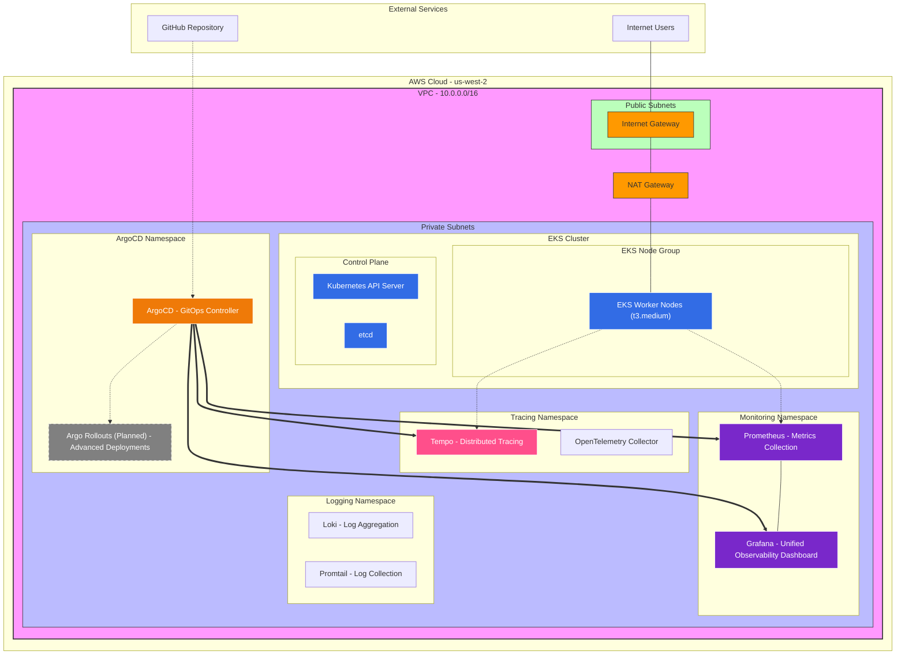
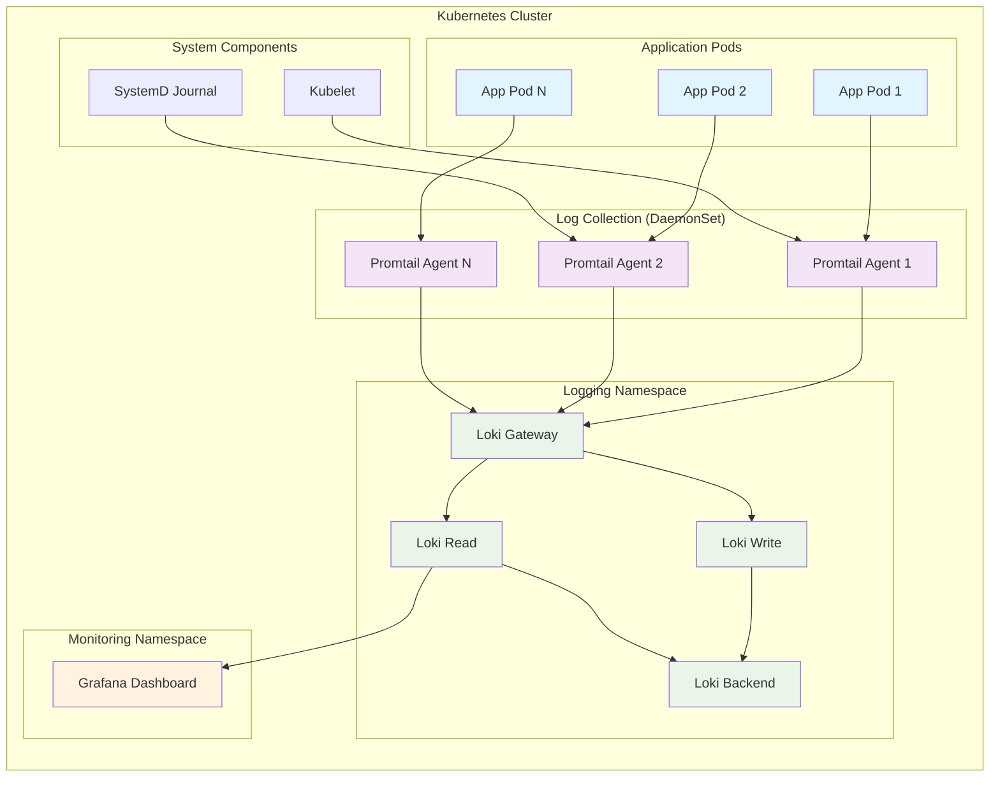
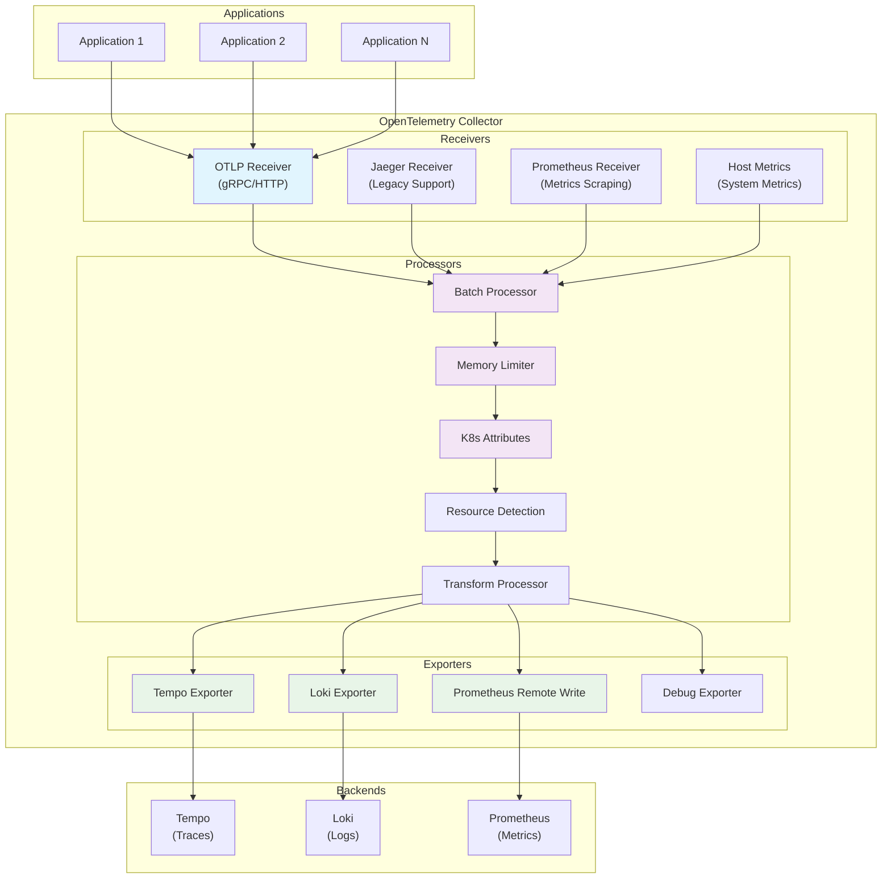

# 🚀 EKS with OpenTelemetry Infrastructure & Sample Crud app

**What's Included:**
- 🏗️ **EKS Cluster Setup** - Automated cluster provisioning with managed node groups
- 📊 **Monitoring Stack** - Prometheus + Grafana with persistent storage
- 📝 **Logging Stack** - Loki + Promtail for log aggregation and visualization
- 🔍 **Distributed Tracing** - Tempo for OpenTelemetry trace collection
- 🔗 **OpenTelemetry Collector** - Centralized observability data collection and processing
- 🚀 **GitOps Deployment** - ArgoCD for continuous deployment
- 🛠️ **Infrastructure as Code** - Terraform configurations for reproducible deployments
- 📜 **Setup & Teardown Scripts** - One-command infrastructure lifecycle management

**🔮 Future Enhancements (TODO):**
- 🔄 **Argo Rollouts** - Advanced deployment strategies (blue-green, canary) for zero-downtime releases
- 🛡️ **Kyverno** - Policy-as-code engine for Kubernetes security and governance automation
- 🔍 **Trivy** - Comprehensive vulnerability scanner for containers, IaC, and Kubernetes manifests
- 📢 **Slack Alerts** - Real-time notifications for monitoring alerts, deployment status, and security events
- 🚨 **Falco** - Runtime security monitoring for detecting anomalous behavior and security threats
- 🔔 **AlertManager** - Advanced alerting rules, routing, and notification management
- ⚡ **Karpenter** - Intelligent node provisioning and autoscaling for cost-optimized workload scheduling

## 🌐 Network Architecture



## 📝 Logging Infrastructure

The logging stack provides comprehensive log aggregation and visualization using Loki and Promtail, integrated with Grafana for unified observability.

### Components

#### Loki (Log Aggregation)
- **Purpose**: Horizontally scalable log aggregation system
- **Storage**: Filesystem-based storage with 7-day retention
- **Architecture**: SimpleScalable deployment mode with separate read/write/backend components
- **Integration**: Native Grafana data source with trace correlation

#### Promtail (Log Collection)
- **Purpose**: Log shipping agent that collects logs from Kubernetes
- **Deployment**: DaemonSet running on all nodes
- **Sources**: 
  - Kubernetes pod logs (stdout/stderr)
  - Node system logs (journal)
- **Processing**: CRI log parsing, label extraction, and filtering

### Log Flow Architecture



### Configuration Files

- **`loki-values.yaml`**: Loki deployment configuration with SimpleScalable mode
- **`promtail-values.yaml`**: Promtail DaemonSet configuration for log collection
- **`prometheus-values.yaml`**: Updated Grafana configuration with Loki data source

### Log Labels and Parsing

Promtail automatically adds these labels to collected logs:
- `namespace`: Kubernetes namespace
- `pod`: Pod name
- `container`: Container name
- `app`: Application label (if present)
- `service`: Service name (if present)
- `node`: Node name
- `job`: Collection job name

### Accessing Logs

1. **Via Grafana**: 
   - Access Grafana dashboard
   - Use "Explore" tab with Loki data source
   - Query logs using LogQL syntax

2. **Direct Loki Access**:
   ```bash
   kubectl port-forward svc/loki-gateway -n logging 3100:80
   curl "http://localhost:3100/loki/api/v1/query_range?query={namespace=\"default\"}"
   ```

3. **Common LogQL Queries**:
   ```logql
   # All logs from a specific namespace
   {namespace="default"}
   
   # Error logs across all pods
   {} |= "error" or "ERROR"
   
   # Logs from specific application
   {app="my-app"} | json
   
   # Rate of error logs
   rate({} |= "error" [5m])
   ```

## 🔗 OpenTelemetry Collector

The enhanced OpenTelemetry Collector serves as the central hub for all observability data, collecting, processing, and routing traces, metrics, and logs to their respective backends.

### Architecture Overview

The collector is deployed as a Kubernetes deployment with 2 replicas, providing high availability and load distribution for telemetry data processing.



### Enhanced Features

#### Multi-Signal Processing
- **Traces**: OTLP and Jaeger protocol support with correlation IDs
- **Metrics**: Application metrics via OTLP + system metrics via host metrics receiver
- **Logs**: OTLP log ingestion with structured log processing

#### Kubernetes Integration
- **K8s Attributes Processor**: Automatically enriches telemetry with Kubernetes metadata
- **Resource Detection**: Identifies cluster, node, and pod information
- **RBAC Configuration**: Proper permissions for Kubernetes API access

#### Advanced Processing
- **Batch Processing**: Optimized data transmission with configurable batch sizes
- **Memory Management**: Prevents OOM with memory limiting and spike protection
- **Attribute Enhancement**: Consistent metadata across all signals
- **Transform Processing**: Log parsing and enrichment

### Configuration Files

- **`otel-collector-values.yaml`**: Enhanced multi-signal collector configuration
- **`otel-collector-values.yaml.backup`**: Backup of original traces-only configuration
- **`validate-otel-config.sh`**: Configuration validation and testing script

### Data Pipelines

#### Traces Pipeline
```yaml
traces:
  receivers: [otlp, jaeger]
  processors: [memory_limiter, resourcedetection, k8sattributes, attributes, batch]
  exporters: [otlp/tempo, debug]
```

#### Metrics Pipeline
```yaml
metrics:
  receivers: [otlp, prometheus, hostmetrics]
  processors: [memory_limiter, resourcedetection, k8sattributes, attributes, batch]
  exporters: [prometheusremotewrite, debug]
```

#### Logs Pipeline
```yaml
logs:
  receivers: [otlp]
  processors: [memory_limiter, resourcedetection, k8sattributes, attributes, transform, batch]
  exporters: [loki, debug]
```

### Resource Configuration

- **CPU**: 1000m limit, 200m request (increased for multi-signal processing)
- **Memory**: 1Gi limit, 256Mi request (increased for buffering and processing)
- **Replicas**: 2 (high availability)

### Endpoints and Ports

| Protocol | Port | Purpose |
|----------|------|----------|
| OTLP gRPC | 4317 | Primary OpenTelemetry protocol |
| OTLP HTTP | 4318 | HTTP variant of OTLP |
| Jaeger gRPC | 14250 | Legacy Jaeger traces |
| Jaeger HTTP | 14268 | Legacy Jaeger traces |
| Jaeger UDP | 6831 | Legacy Jaeger traces |
| Metrics | 8888 | Collector self-monitoring |

### Monitoring and Observability

The collector monitors itself and exports metrics about:
- Data processing rates and latencies
- Memory and CPU usage
- Queue sizes and backpressure
- Export success/failure rates
- Pipeline health status

### Validation and Testing

Use the validation script to test configuration before deployment:

```bash
# Validate enhanced configuration
./scripts/validate-otel-config.sh

# Deploy enhanced collector
helm upgrade otel-collector open-telemetry/opentelemetry-collector \
  -n tracing \
  -f eks-infrastructure/monitoring/otel-collector-values.yaml

# Monitor deployment
kubectl logs -f deployment/otel-collector -n tracing
```

### Rollback Procedure

If issues occur with the enhanced configuration:

```bash
# Restore backup configuration
cp eks-infrastructure/monitoring/otel-collector-values.yaml.backup \
   eks-infrastructure/monitoring/otel-collector-values.yaml

# Redeploy with original configuration
helm upgrade otel-collector open-telemetry/opentelemetry-collector \
  -n tracing \
  -f eks-infrastructure/monitoring/otel-collector-values.yaml
```

## 📋 Prerequisites Check

```bash
# Check if all tools are installed
./setup-infrastructure.sh
```

## 🏗️ Infrastructure Setup (Copy & Paste in Order)

### Step 1: Create EKS Cluster
```bash
# Create the EKS cluster (15-20 minutes)
eksctl create cluster -f eks-infrastructure/eks-cluster.yaml

# Verify cluster creation
kubectl get nodes
```

### Step 2: Configure kubectl
```bash
# Update kubeconfig for new cluster
aws eks update-kubeconfig --region us-west-2 --name eks-otel-crud

# Verify access
kubectl get svc
```

### Step 3: Install Helm Repositories
```bash
# Add required Helm repositories
helm repo add prometheus-community https://prometheus-community.github.io/helm-charts
helm repo add argo https://argoproj.github.io/argo-helm
helm repo update
```

### Step 4: Deploy Monitoring Stack
```bash
# Create monitoring namespace
kubectl create namespace monitoring

# Install Prometheus + Grafana
helm install prometheus prometheus-community/kube-prometheus-stack \
  --namespace monitoring \
  --values eks-infrastructure/monitoring/prometheus-values.yaml

# Wait for deployment
kubectl wait --for=condition=available deployment/prometheus-kube-prometheus-stack-prometheus -n monitoring --timeout=300s
```

### Step 5: Deploy ArgoCD
```bash
# Create ArgoCD namespace
kubectl create namespace argocd

# Install ArgoCD
kubectl apply -n argocd -f https://raw.githubusercontent.com/argoproj/argo-cd/stable/manifests/install.yaml

# Wait for ArgoCD
kubectl wait --for=condition=available deployment/argocd-server -n argocd --timeout=300s
```

### Step 6: Get Access URLs
```bash
# Get ArgoCD URL
ARGOCD_URL=$(kubectl get svc argocd-server -n argocd -o jsonpath='{.status.loadBalancer.ingress[0].hostname}')
echo "ArgoCD: https://$ARGOCD_URL"

# Get Grafana URL
GRAFANA_URL=$(kubectl get svc prometheus-grafana -n monitoring -o jsonpath='{.status.loadBalancer.ingress[0].hostname}')
echo "Grafana: https://$GRAFANA_URL"

# Get ArgoCD password
ARGOCD_PASSWORD=$(kubectl -n argocd get secret argocd-initial-admin-secret -o jsonpath="{.data.password}" | base64 -d)
echo "ArgoCD Password: $ARGOCD_PASSWORD"
```

### Step 7: Configure ArgoCD
```bash
# Apply ArgoCD application
kubectl apply -f eks-infrastructure/argocd/argocd-app.yaml
```

### Step 8: Validate
```bash
# Check all components
kubectl get nodes
kubectl get pods -n monitoring
kubectl get pods -n argocd
```

## 📊 Default Credentials
| Service | Username | Password | Method |
|---------|----------|----------|---------|
| Grafana | admin | admin123 | kubectl |
| ArgoCD | admin | kubectl | kubectl |

## 🔧 Quick Commands
```bash
# Port forwarding
kubectl port-forward svc/argocd-server -n argocd 8080:443
kubectl port-forward svc/prometheus-grafana -n monitoring 3000:80
```

---

**Ready? Start with Step 1!**
