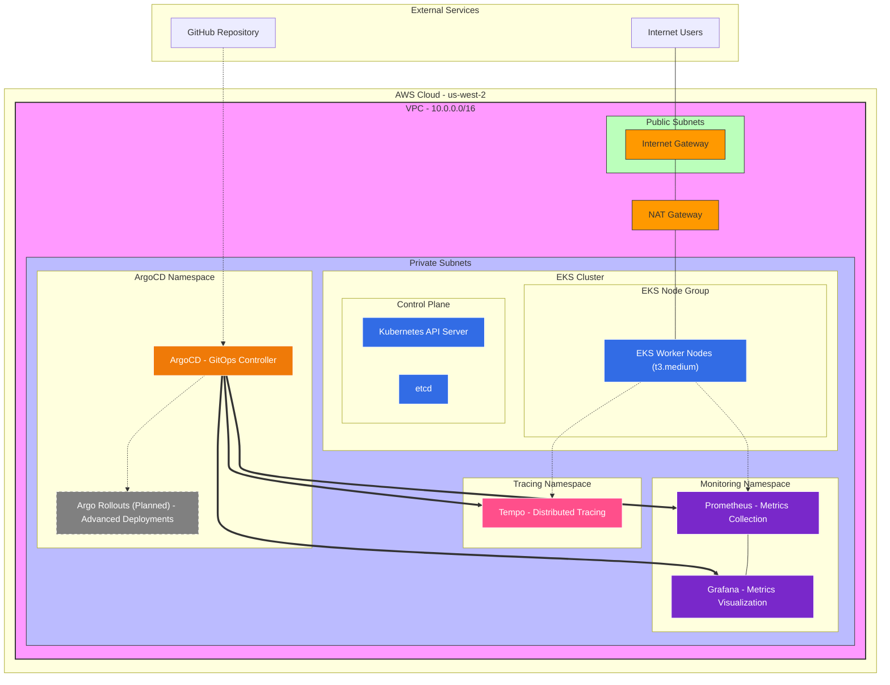

# 🚀 EKS with OpenTelemetry Infrastructure & Sample Crud app

**What's Included:**
- 🏗️ **EKS Cluster Setup** - Automated cluster provisioning with managed node groups
- 📊 **Monitoring Stack** - Prometheus + Grafana with persistent storage
- 🔍 **Distributed Tracing** - Tempo for OpenTelemetry trace collection
- 🚀 **GitOps Deployment** - ArgoCD for continuous deployment
- 🛠️ **Infrastructure as Code** - Terraform configurations for reproducible deployments
- 📜 **Setup & Teardown Scripts** - One-command infrastructure lifecycle management
- 🎯 **Sample CRUD App** - Go application demonstrating platform capabilities

**🔮 Future Enhancements (TODO):**
- 🔄 **Argo Rollouts** - Advanced deployment strategies (blue-green, canary) for zero-downtime releases
- 🛡️ **Kyverno** - Policy-as-code engine for Kubernetes security and governance automation
- 🔍 **Trivy** - Comprehensive vulnerability scanner for containers, IaC, and Kubernetes manifests
- 📢 **Slack Alerts** - Real-time notifications for monitoring alerts, deployment status, and security events
- 🚨 **Falco** - Runtime security monitoring for detecting anomalous behavior and security threats
- 📝 **Loki** - Log aggregation system to complete the observability trinity (metrics, traces, logs)
- 🔔 **AlertManager** - Advanced alerting rules, routing, and notification management
- ⚡ **Karpenter** - Intelligent node provisioning and autoscaling for cost-optimized workload scheduling

## 🌐 Network Architecture



## 📋 Prerequisites Check

```bash
# Check if all tools are installed
./setup-infrastructure.sh
```

## 🏗️ Infrastructure Setup (Copy & Paste in Order)

### Step 1: Create EKS Cluster
```bash
# Create the EKS cluster (15-20 minutes)
eksctl create cluster -f eks-infrastructure/eks-cluster.yaml

# Verify cluster creation
kubectl get nodes
```

### Step 2: Configure kubectl
```bash
# Update kubeconfig for new cluster
aws eks update-kubeconfig --region us-west-2 --name eks-otel-crud

# Verify access
kubectl get svc
```

### Step 3: Install Helm Repositories
```bash
# Add required Helm repositories
helm repo add prometheus-community https://prometheus-community.github.io/helm-charts
helm repo add argo https://argoproj.github.io/argo-helm
helm repo update
```

### Step 4: Deploy Monitoring Stack
```bash
# Create monitoring namespace
kubectl create namespace monitoring

# Install Prometheus + Grafana
helm install prometheus prometheus-community/kube-prometheus-stack \
  --namespace monitoring \
  --values eks-infrastructure/monitoring/prometheus-values.yaml

# Wait for deployment
kubectl wait --for=condition=available deployment/prometheus-kube-prometheus-stack-prometheus -n monitoring --timeout=300s
```

### Step 5: Deploy ArgoCD
```bash
# Create ArgoCD namespace
kubectl create namespace argocd

# Install ArgoCD
kubectl apply -n argocd -f https://raw.githubusercontent.com/argoproj/argo-cd/stable/manifests/install.yaml

# Wait for ArgoCD
kubectl wait --for=condition=available deployment/argocd-server -n argocd --timeout=300s
```

### Step 6: Get Access URLs
```bash
# Get ArgoCD URL
ARGOCD_URL=$(kubectl get svc argocd-server -n argocd -o jsonpath='{.status.loadBalancer.ingress[0].hostname}')
echo "ArgoCD: https://$ARGOCD_URL"

# Get Grafana URL
GRAFANA_URL=$(kubectl get svc prometheus-grafana -n monitoring -o jsonpath='{.status.loadBalancer.ingress[0].hostname}')
echo "Grafana: https://$GRAFANA_URL"

# Get ArgoCD password
ARGOCD_PASSWORD=$(kubectl -n argocd get secret argocd-initial-admin-secret -o jsonpath="{.data.password}" | base64 -d)
echo "ArgoCD Password: $ARGOCD_PASSWORD"
```

### Step 7: Configure ArgoCD
```bash
# Apply ArgoCD application
kubectl apply -f eks-infrastructure/argocd/argocd-app.yaml
```

### Step 8: Validate
```bash
# Check all components
kubectl get nodes
kubectl get pods -n monitoring
kubectl get pods -n argocd
```

## 📊 Default Credentials
| Service | Username | Password | Method |
|---------|----------|----------|---------|
| Grafana | admin | admin123 | kubectl |
| ArgoCD | admin | kubectl | kubectl |

## 🔧 Quick Commands
```bash
# Port forwarding
kubectl port-forward svc/argocd-server -n argocd 8080:443
kubectl port-forward svc/prometheus-grafana -n monitoring 3000:80
```

---

**Ready? Start with Step 1!**
